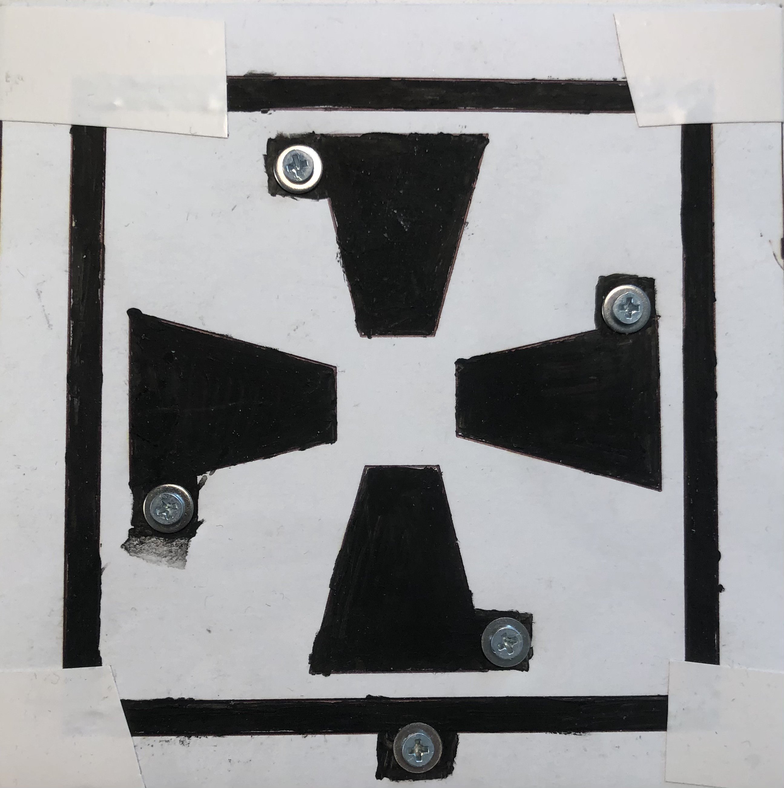
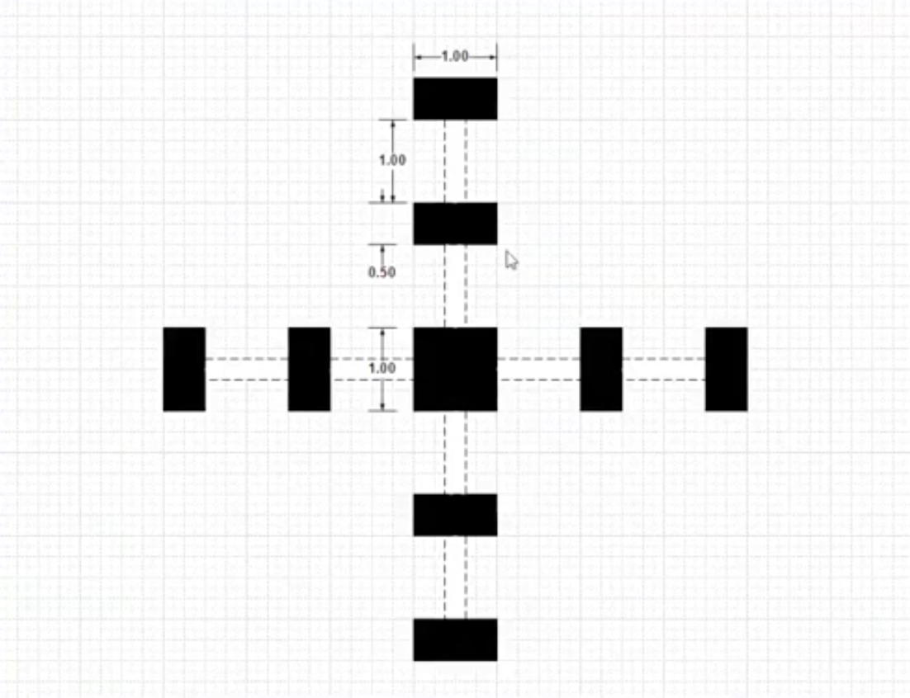

# SER 401 Capstone Project 2020-2021
### Project 28 - Proximity Sensing in a Post-COVID World

# The Project
## Table of Contents  
I. [The Team](#team)  
II. [The Idea](#headers)  
III. [What Didn't Work](#emphasis)  
IV. [What Did Work](#worked)  
V. [Final Product](#notworked)  
VI. [The Future](#nexttime)  
VII. [Requirements](#requirements)  
VIII. [Setup and Run](#setup)   

<a name="team"/>

## The Team

Bob Martin 
Dylan Johnson 
Joshua Carpenter 
Kelly Petrone 
Michael Frederic 
Russell Smith 

<a name="headers"/>

# The Idea

  2020 was a huge year for humanity. Overnight there were unlimited problems being faced on a day to day basis. Whether it be social distancing, mask wearing, or quarantine. Our project had the goal to help solve one of these problems with a focus on software being developed by students at ASU, and the hardware being built and provided by Microchip.

  With this goal in mind, we knew a large problem people faced in a time where it wasn't known how long COVID survived on physical surfaces was to help avoid touching surfaces while operating through a daily routine. The goal was to develop a sensor, and using machine learning process data from the sensor to eliminate the need for a user to physically touch surfaces that other people would also be touching.

  The team bounced around with several ideas. But one that really stuck out to us was the need for people to touch an ATM. The ATM, originally designed in 1967 hasn't seen any updates in years. Still requiring a user to use a pin pad, touching a surface that many other people could have touched. We decided that this was going to be the focus of our project. 

<a name="emphasis"/>

# What Didn't Work
  The first step of our design process involved using the QT-7 sensor pictured below. We used this to get an idea of what the data looked like coming off of the sensor. We originally though the QT-7 had the chance of being a proximity sensor for a real world application. Through thorough testing we quickly discovered that we were unable to get accurate and consistent results. The sensors on the QT-7 were too close and different gestures were not distinct enough from each other for reliable classification. This took us back to the drawing board.

  > QT-7 

  

  After the QT-7, Bob tipped us off to a friend's company of his that designs paint that is electronically conductive and could potentially detect proximity of a user's hand. Once we realized this; the next iteration of design is the proximity sensor pictured below.

  > Original Sensor Design

  

  When we started testing and applying Machine Learning to the data being produced from the sensor above, we were unable to get a sufficiently accurate classification model. With both the QT-7 and this new 4-sensor board, the delta values were inconsistent between sessions. Additionally, they would sometimes hold a charge and render the data processing dysfunctional as it relied on a delta threshold being exceeded. When a charge was held, the output data no longer reflected a standard gesture signature. Even when not holding a charge, though, we found the data of each gesture to be too similar to each other for accurate classification. The close proximity of the sensors and the lack of distinct gesture signatures in the output data led use to reach out to our sponsor, Bob, for a different design. Collectively, we discussed a series of designs for potential sensors. Below are the results of those design mockups.

  > Final Sensor Design Mockups

  

  After talking through several of these designs and their upsides we landed on the one below. After testing we were quickly able to apply a machine learning algorithm to the sensor output data and have it detect hand motions at a very high accuracy. We will discuss this further later on.

  > Final Sensor Design
  

  In developing a machine learning model that works best for our application there were several choices of model types. Below is a list of models that we tested prior to landing on a LSTM (Long Term Short Memory Network) model.

  - RNN
  - GRU
  - LSTM

  > In testing, below is a chart of the models compared to eachother with their accuracy rates:

  

  We eventually decided on using an LSTM model due to the overall advantage in accuracy rates. However, our comparisons were made using data from the QT-7 device and we tested several related algorithms with data from our 9-sensor device. The accuracy of these models is noted below:

  | Model  | Prediction Accuracy |
  | ------ |:-------------------:|
  | LSTM   | 99.2                |
  | GRU    | 98.0                |
  | RNN    | 90.4                |

  A more detailed explanation of what exactly a Long Term Short Memory Network is as stated by on a great breakdown by [Christopher Olah](https://colah.github.io/posts/2015-08-Understanding-LSTMs/):

  > Long Short Term Memory networks – usually just called “LSTMs” – are a special kind of RNN, capable of learning long-term dependencies. They were introduced by Hochreiter & Schmidhuber (1997), and were refined and popularized by many people in following work.1 They work tremendously well on a large variety of problems, and are now widely used. LSTMs are explicitly designed to avoid the long-term dependency problem. Remembering information for long periods of time is practically their default behavior, not something they struggle to learn!

<a name="worked"/>

# What Did Work (Eventually)

### Core Idea
To restate the core idea; by using a sensitive sensor design that can detect hand proximity without physical touch; create a real world solution to eliminate the need of touching surfaces to avoid the potential cross contanimation further spreading potential virus and disease unknowingly to others. This project, focusing on the decade old design of a touch pad ATM interface.

### The Back End
As stated above, after thorough testing and application; we landed on using an LSTM model. In addition to this, we elected to use a local lightweight database to simulate a database interface with an actual bank system. In the real world, this would be wrapped in several levels of authentication. In the testing and decision to go leightweight and straightforward we considered several other options like video card detection or facial detection. One large gap to be covered is a way for a user to use an ATM without having to insert their card. With the rise of contactless cards in the United States, it is likely that soon we will see these on most ATMs regardless.  

Throughout our process, great attention was paid to the sensor output data. It was important for the output data to be consistent across devices, but we also needed to attempt using differing lengths and formats to optimize the model's ability to classify gestures. For the data to be processed, a program must read in sensor output data and wait to process when a gesture is made. This was done by having the program wait for a set delta value, which depended on how each device responded to stimuli. The proper delta threshold had to be a value that rarely, if ever, was exceeded without human interaction, but also promptly was exceeded with human interaction. The length of the data also varied based on device as each device and different microcontroller builds were capable of different polling rates and overall speed of output data. The appropriate data length, which corresponds to duration of gesture, was when a gesture had been completed and sensor activity had returned to baseline. With our threshold model, though, we found that the data preceeding the threshold being broken was not considered and would likely assist with gesture classification by the prediction model. Our solution was to store previous rows in a continually updating stack which fed into the output data immediately upon the threshold being broken. This gave the output data a neutral output at the beginning and end to show the subtle data changes between neutral and human interaction.  

> Swipe Data Compared (left swipe, right swipe, up swipe)
  
The machine learning model also required several specifications to be accurate. Firstly, because the data we are working with is sensor data through a brief period of time, a sequential model was determined to be appropriate. Since we were searching for classification of several different gestures, a categorical model classification would be appropriate. This meant our data would need to be more distinct as categorical classification is more challenging than a binary classification model. The data from each sensor was set to be represented by its own individual layer in building the model, rather than having the sensor output data into a single two-dimensional layer (similar to a spreadsheet). This did lead to additional data processing steps for building the model, but no changes in using the gesture recognition prediction model.

### The Front End
Now to discuss the front end portion of the project. To our surprise in our initial research after landing on an ATM for our final project. ATM interfaces designed today are almost identical to those that were designed decades ago. This has a lot to do with the fact that ATMs are typically coded in low level langauges like C and C++, which are easier to run on cheaper hardware due to it being more lightweight. To make our project as portable as possible, we negated bringing in a larger interface library and landed on using a built-in Python library. This allowed us to have less dependencies, create an equally lightweight project, while still upgrading from the original C and C++ ATM designs. 

<a name="notworked"/>

## Final Product

> Pictured above is the finished product, demonstrating the complete use of the proximity sensor, a Python ATM front end, a machine learning powered backend, all connected to a seemless SQL database.

<a name="nexttime"/>

# The Future
### Where can this be used?
The use case for this project is global. Considering ATMs across the globe are still using archaic physical touch cheap hardware designs. A simple machine learning application can completely revamp the marketplace.

# Running the project

<a name="Requirements"/>

## Requirements
The requirements are straightforward, on your computer you need an updated working copy of the following programs;
1. Python 3.7+
2. Pip
3. 9 point sensor design 

<a name="setup"/>

## Setup and Run
Included in this repo is pip requirements file. By running the following command in your terminal;

`pip install -r pip_requirements.txt && python src/atm_interface_v1.py`

